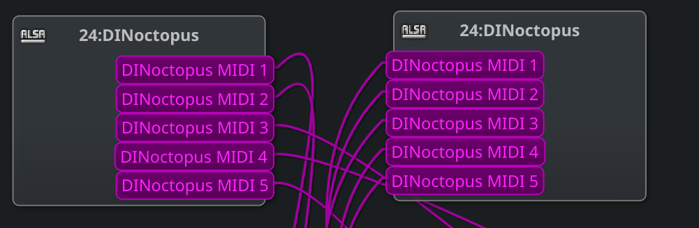

# DINOctopus


## What is it

DINOctopus is a small device made to merge/split/mix MIDI signals and act as a USB card as well.


<--->





## Structure

This is a general diagram of when the device has 10 physical ports (5 in and 5 out).
All the physical ports can be routed to any other port. 


flowchart TB
subgraph Physical
MIDI_1_IN[Midi Input 1] -.-> MIDI_1_OUT[Midi Output 1]
MIDI_1_IN[Midi Input 1] -.-> MIDI_2_OUT[Midi Output 2]
MIDI_1_IN[Midi Input 1] -.-> MIDI_3_OUT[Midi Output 3]
MIDI_1_IN[Midi Input 1] -.-> MIDI_4_OUT[Midi Output 4]
MIDI_1_IN[Midi Input 1] -.-> MIDI_5_OUT[Midi Output 5]
MIDI_2_IN[Midi Input 2] -.-> MIDI_1_OUT[Midi Output 1]
MIDI_2_IN[Midi Input 2] -.-> MIDI_2_OUT[Midi Output 2]
MIDI_2_IN[Midi Input 2] -.-> MIDI_3_OUT[Midi Output 3]
MIDI_2_IN[Midi Input 2] -.-> MIDI_4_OUT[Midi Output 4]
MIDI_2_IN[Midi Input 2] -.-> MIDI_5_OUT[Midi Output 5]
MIDI_3_IN[Midi Input 3] -.-> MIDI_1_OUT[Midi Output 1]
MIDI_3_IN[Midi Input 3] -.-> MIDI_2_OUT[Midi Output 2]
MIDI_3_IN[Midi Input 3] -.-> MIDI_3_OUT[Midi Output 3]
MIDI_3_IN[Midi Input 3] -.-> MIDI_4_OUT[Midi Output 4]
MIDI_3_IN[Midi Input 3] -.-> MIDI_5_OUT[Midi Output 5]
MIDI_4_IN[Midi Input 4] -.-> MIDI_1_OUT[Midi Output 1]
MIDI_4_IN[Midi Input 4] -.-> MIDI_2_OUT[Midi Output 2]
MIDI_4_IN[Midi Input 4] -.-> MIDI_3_OUT[Midi Output 3]
MIDI_4_IN[Midi Input 4] -.-> MIDI_4_OUT[Midi Output 4]
MIDI_4_IN[Midi Input 4] -.-> MIDI_5_OUT[Midi Output 5]
MIDI_5_IN[Midi Input 5] -.-> MIDI_1_OUT[Midi Output 1]
MIDI_5_IN[Midi Input 5] -.-> MIDI_2_OUT[Midi Output 2]
MIDI_5_IN[Midi Input 5] -.-> MIDI_3_OUT[Midi Output 3]
MIDI_5_IN[Midi Input 5] -.-> MIDI_4_OUT[Midi Output 4]
MIDI_5_IN[Midi Input 5] -.-> MIDI_5_OUT[Midi Output 5]
end
subgraph USB_in
USB_1_IN[USB In 1] --> MIDI_1_IN[Midi Input 1]
USB_2_IN[USB In 2] --> MIDI_2_IN[Midi Input 2]
USB_3_IN[USB In 3] --> MIDI_3_IN[Midi Input 3]
USB_4_IN[USB In 4] --> MIDI_4_IN[Midi Input 4]
USB_5_IN[USB In 5] --> MIDI_5_IN[Midi Input 5]
end
subgraph USB_out
MIDI_1_OUT[Midi Output 1] --> USB_1_OUT[USB Out 1]
MIDI_2_OUT[Midi Output 2] --> USB_2_OUT[USB Out 2]
MIDI_3_OUT[Midi Output 3] --> USB_3_OUT[USB Out 3]
MIDI_4_OUT[Midi Output 4] --> USB_4_OUT[USB Out 4]
MIDI_5_OUT[Midi Output 5] --> USB_5_OUT[USB Out 5]
end



The USB ports are virtual and will through a single cable be displayed as multiple ports in your operating system:



## Configuration

The configuration is done using SysEX, there is a WebMidi implementation here:
[SysEx Configurator](./sysex-configurator)


## Open Source Hardware and Software
### Software

The firmware is available here: [https://www.github.com/bjonnh/dinoctopus](https://www.github.com/bjonnh/dinoctopus)

There are builds of the UF2 files that can be directly sent to a RP2040 board by USB.
Plug it while pressing the BOOTSEL button, and it will appear as a USB drive, just copy the file to it.

Latest release is always available at: [https://github.com/bjonnh/dinoctopus/releases/latest](https://github.com/bjonnh/dinoctopus/releases/latest)

The C++ code documentation is at [./dox](./dox) but that's probably not super useful.

#### SysEX messages

This is the structure of the messages:
```
F0 44 49 4E 4F 00 <command> [optional_data] F7
```

Where

```
44 49 4E 4F  : Identifier of the device (DINO)
00            : Device number (0)
```

F0 and F7 are the normal sysex delimiters

and the replies:

```
F0 44 49 4E 4F 00 66 <response> F7
```


The commands are:

| Command | Description                   | Data                                                                |
|---------|-------------------------------|---------------------------------------------------------------------|   
| 0x00    | Identity (Not implemented)    |                                                                     |     
| 0x01    | Dump the matrix               | None                                                                |
| 0x02    | Set the matrix                | 100 uint32/7 numbers (see below the format)                         |   
| 0x03    | Get the matrix element at i,j | 2 uint8 between 0 and 5 for the input and output                    |  
| 0x04    | Set the matrix element at i,j | 3 uint8 between 0 and 5 for the input, output and value as uint32/7 | 
| 0x05    | Save in the EEPROM            | None                                                                |  
| 0x06    | Load from the EEPROM          | None                                                                |
| 0x07    | Reset everything to 0         | None                                                                |

All commands will return either : 0x60 (ACK) or 0x61 (NACK) except for 0x01 and 0x03 that are special.

Technically there is no EEPROM on the RP2040, but I use the flash for that. It is not supposed to be written too often
so don't hammer it thousands of times.

Any command that do not match the above will just be forwared to the port.

#### Dump the matrix (0x01)

This returns 100 uint32/7 numbers. You can safely convert them to uint32.

#### Get the element (0x03)

This returns one uint32/7 number that can be safely converted to uint32.

#### What is uint32/7:

Currently the values are stored internaly as an uint32_t, and we only use 0 and 1. The other bits will be used for filtering and other
features. I call the type uint32/7 because SysEX only allow to send 7 bits per element, so we end up with truncated values.
They are LSB.
So 1 is :
1 0 0 0

250 cannot be represented

But 256 can:
0 1 0 0

Etc.

I will probably send the sysex differently at some point or just ignore that 1 bit, we will see when we get there.


### Hardware

The hardware is not really up to date, I'll be fixing that next.

What I recommend for now is to build the TX and RX boards and connect them to a RP2040 board (like the Raspberry Pi Pico).

I made two boards so they can be stacked to make the device smaller. There is really nothing special about them, they
are just pulled up TXs and the RXs with their optocouplers.

Schematics and PCBs are available at: [https://www.github.com/bjonnh/dinoctopus/tree/main/hardware/electronics](https://www.github.com/bjonnh/dinoctopustree/main/hardware/electronics)


### History

It used a repurposed cheap 3d printer display which is documented on [https://www.bjonnh.net/article/20221126_mini_12864/](https://www.bjonnh.net/article/20221126_mini_12864/). 

I switched to a pure SysEx approach to facilitate things and reduce cost and size.

### Interface

The settings can be seen and modified on the integrated display using the integrated rotary encoder:


