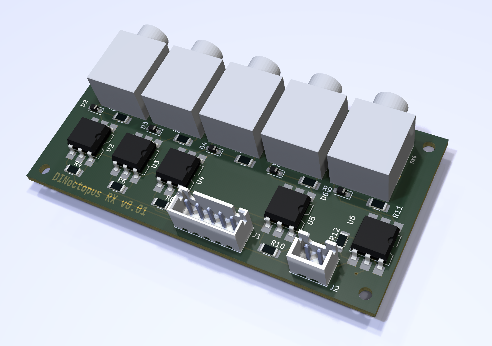

# DINOctopus


## What is it

DINOctopus is a small device made to merge/split/mix MIDI signals and act as a USB card as well.

<--->



## Interface

The settings can be seen and modified on the integrated display using the integrated rotary encoder:

## Structure

This is a general diagram of when the device has 8 physical ports (4 in and 4 out).
All the physical ports can be routed to any other port. 


flowchart TB
subgraph Physical
MIDI_1_IN[Midi Input 1] -.-> MIDI_1_OUT[Midi Output 1]
MIDI_1_IN[Midi Input 1] -.-> MIDI_2_OUT[Midi Output 2]
MIDI_1_IN[Midi Input 1] -.-> MIDI_3_OUT[Midi Output 3]
MIDI_1_IN[Midi Input 1] -.-> MIDI_4_OUT[Midi Output 4]
MIDI_2_IN[Midi Input 2] -.-> MIDI_1_OUT[Midi Output 1]
MIDI_2_IN[Midi Input 2] -.-> MIDI_2_OUT[Midi Output 2]
MIDI_2_IN[Midi Input 2] -.-> MIDI_3_OUT[Midi Output 3]
MIDI_2_IN[Midi Input 2] -.-> MIDI_4_OUT[Midi Output 4]
MIDI_3_IN[Midi Input 3] -.-> MIDI_1_OUT[Midi Output 1]
MIDI_3_IN[Midi Input 3] -.-> MIDI_2_OUT[Midi Output 2]
MIDI_3_IN[Midi Input 3] -.-> MIDI_3_OUT[Midi Output 3]
MIDI_3_IN[Midi Input 3] -.-> MIDI_4_OUT[Midi Output 4]
MIDI_4_IN[Midi Input 4] -.-> MIDI_1_OUT[Midi Output 1]
MIDI_4_IN[Midi Input 4] -.-> MIDI_2_OUT[Midi Output 2]
MIDI_4_IN[Midi Input 4] -.-> MIDI_3_OUT[Midi Output 3]
MIDI_4_IN[Midi Input 4] -.-> MIDI_4_OUT[Midi Output 4]
end
subgraph USB_in
USB_1_IN[USB In 1] --> MIDI_1_IN[Midi Input 1]
USB_2_IN[USB In 2] --> MIDI_2_IN[Midi Input 2]
USB_3_IN[USB In 3] --> MIDI_3_IN[Midi Input 3]
USB_4_IN[USB In 4] --> MIDI_4_IN[Midi Input 4] 
end
subgraph USB_out
MIDI_1_OUT[Midi Output 1] --> USB_1_OUT[USB Out 1]
MIDI_2_OUT[Midi Output 2] --> USB_2_OUT[USB Out 2]
MIDI_3_OUT[Midi Output 3] --> USB_3_OUT[USB Out 3]
MIDI_4_OUT[Midi Output 4] --> USB_4_OUT[USB Out 4]
end



The USB ports are virtual and will through a single cable be displayed as multiple ports in your operating system:

## Open Source Hardware and Software
### Software
The Software is already available here: [https://www.github.com/bjonnh/dinoctopus](https://www.github.com/bjonnh/dinoctopus)

The code documentation is at [./doc](./doc)

### Hardware
The hardware schematics and PCBs will be made available soon.

It uses a repurposed cheap 3d printer display which is documented on [https://www.bjonnh.net/article/20221126_mini_12864/](https://www.bjonnh.net/article/20221126_mini_12864/). 